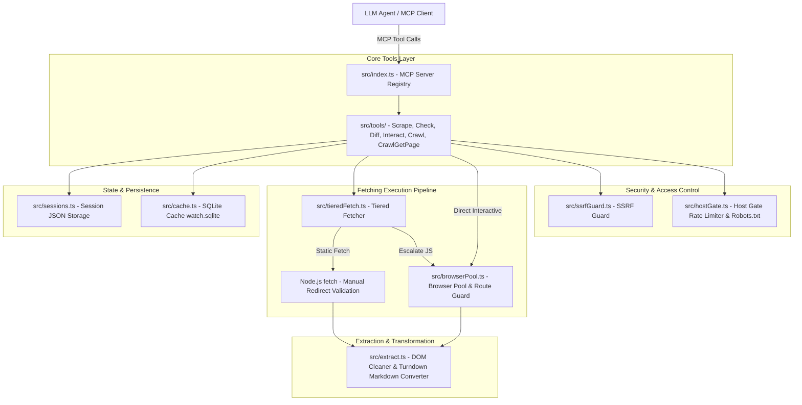

# `webmesh-mcp` — Technical Architecture & Design Document

`webmesh-mcp` is a Model Context Protocol (MCP) server engineered for token-economical web browsing, content extraction, claim verification, change monitoring, session-aware interaction, and structured crawling.

---

## 1. High-Level Architecture Overview

---

## 2. Component Breakdown

### 2.1 Tool Registration & Entrypoint ([`src/index.ts`](file:///Users/piyush.anand/self_code/mcp-web-agent/src/index.ts))
Registers seven MCP tools using `@modelcontextprotocol/sdk`:
- [`web_scrape`](file:///Users/piyush.anand/self_code/mcp-web-agent/src/tools/scrape.ts): Converts web pages to clean markdown or structured JSON schema without noise.
- [`web_check`](file:///Users/piyush.anand/self_code/mcp-web-agent/src/tools/check.ts): Verifies assertions (`contains`, `selector_exists`, etc.) returning short evidence snippets instead of full pages.
- [`web_diff`](file:///Users/piyush.anand/self_code/mcp-web-agent/src/tools/diff.ts): Monitors page/element content for changes against stored content hashes.
- [`web_interact`](file:///Users/piyush.anand/self_code/mcp-web-agent/src/tools/interact.ts): Executes interactive action sequences (click, fill, select, press, waitFor) in Playwright, returning ARIA accessibility snapshots.
- [`web_session_close`](file:///Users/piyush.anand/self_code/mcp-web-agent/src/sessions.ts): Deletes persisted session storage state files.
- [`web_crawl`](file:///Users/piyush.anand/self_code/mcp-web-agent/src/tools/crawl.ts): Performs BFS link discovery while caching markdown for discovered pages.
- [`web_crawl_get_page`](file:///Users/piyush.anand/self_code/mcp-web-agent/src/tools/crawlGetPage.ts): Retrieves full cached markdown for previously crawled URLs.

---

### 2.2 Security Layer: SSRF Defense ([`src/ssrfGuard.ts`](file:///Users/piyush.anand/self_code/mcp-web-agent/src/ssrfGuard.ts))
Protects internal network boundaries against Server-Side Request Forgery (SSRF).

- **Protocol Restriction**: Enforces `http:` and `https:` schemes exclusively.
- **Literal IP & DNS Resolution Audit**: Resolves all A/AAAA records for hostnames via `dns.lookup({ all: true })`.
- **IPv4 Blocked Ranges**: Loopback (`127.0.0.0/8`), Private (`10.0.0.0/8`, `172.16.0.0/12`, `192.168.0.0/16`), Link-local / Cloud metadata (`169.254.0.0/16`), This network (`0.0.0.0/8`), Multicast/Reserved (`224.0.0.0/4`).
- **IPv6 Blocked Ranges**: Unspecified (`::`), Loopback (`::1`), Link-local (`fe80::/10`), Unique Local (`fc00::/7`), Site-local (`fec0::/10`), Documentation (`2001:db8::/32`), and normalized IPv4-mapped IPv6 ranges (`::ffff:x.x.x.x`).
- **HTTP Redirect Hardening**: Static fetch uses `redirect: "manual"` loops (max 5 hops), evaluating `ssrfGuard.assertPublicUrl()` on every intermediate `Location` header before following.
- **Browser Route Interceptor**: Playwright contexts attach `page.route("**/*")` interceptors to evaluate outbound HTTP request target URLs against `assertPublicUrl()`.

---

### 2.3 Host Gate & Rate Limiting ([`src/hostGate.ts`](file:///Users/piyush.anand/self_code/mcp-web-agent/src/hostGate.ts))
Governs outbound request cadence and compliance with web standards.

- **`SimpleRobotsParser`**: Parses `/robots.txt` rules per User-Agent. Safely escapes regex special characters in path rules.
- **`checkRobots()`**: Fetches and caches `/robots.txt` for 1 hour. Validates robots requests through `ssrfGuard`.
- **`SimpleHostQueue`**: Per-host execution queues enforcing rate limits (minimum 250ms interval, dynamically updated if robots `Crawl-delay` specifies a longer delay).

---

### 2.4 Tiered Fetching Pipeline ([`src/tieredFetch.ts`](file:///Users/piyush.anand/self_code/mcp-web-agent/src/tieredFetch.ts))
Maximizes performance and minimizes token consumption by selecting the lightest fetch mechanism available.

1. **Static HTTP Tier**: Executes plain `fetch()` GET request with response size capping (10MB limit).
2. **Thin-Content Heuristic ([`src/extract.ts`](file:///Users/piyush.anand/self_code/mcp-web-agent/src/extract.ts#L51))**: Evaluates body text length (< 100 chars) or SPA mount point initialization (`#root`, `#app`, `#___next`).
3. **Browser Escalation Tier**: Automatically escalates to Chromium via `browserPool` if static HTML is a client-side rendered SPA shell or if `forceBrowser: true` is requested.

---

### 2.5 Browser Pool & Lifecycle ([`src/browserPool.ts`](file:///Users/piyush.anand/self_code/mcp-web-agent/src/browserPool.ts))
- **Single Process Reuse**: Maintains one persistent Chromium browser process across server lifetime to avoid 1-2s cold-start overheads per call.
- **Crash Recovery**: `getBrowser()` validates `browser.isConnected()` and automatically re-launches a new Chromium process if the browser crashed or disconnected.
- **Isolated Contexts**: Creates fresh `BrowserContext` instances per request, supporting Playwright `storageState` injection.

---

### 2.6 DOM Clean & Markdown Extraction ([`src/extract.ts`](file:///Users/piyush.anand/self_code/mcp-web-agent/src/extract.ts))
- **Noise Stripping**: Removes non-content tags (`script`, `style`, `noscript`, `svg`, `iframe`, `nav`, `footer`, `.cookie-banner`, `.ad`).
- **Markdown Conversion**: Uses `turndown` with ATX headers and fenced code blocks. Images are stripped by default to conserve LLM context tokens.
- **Selector Query Resilience**: Safely wraps selector queries in try/catch blocks to gracefully handle invalid CSS selectors.

---

### 2.7 State Management & Persistence

- **Session Persistence ([`src/sessions.ts`](file:///Users/piyush.anand/self_code/mcp-web-agent/src/sessions.ts))**: Atomic JSON serialization of Playwright `storageState` under `.webmesh-mcp/sessions/<hash>.json` with a 7-day pruning sweep.
- **SQLite Watch & Crawl Cache ([`src/cache.ts`](file:///Users/piyush.anand/self_code/mcp-web-agent/src/cache.ts))**: Stores SHA-256 hashes for `web_diff` checks and caches full markdown outputs during `web_crawl` operations in `.webmesh-mcp/cache/watch.sqlite`.
